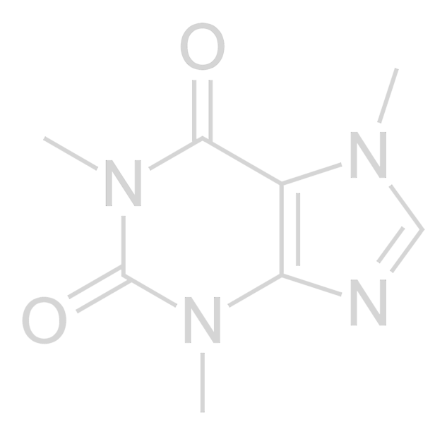

**Podcast Audio Prep for macOS**

WaxOn/WaxOff is a two-mode audio tool for podcasters. **WaxOn** prepares raw recordings for editing — high-pass filtering, loudness normalization, phase rotation, and brick-wall limiting. **WaxOff** finalizes your edited mix for distribution — EBU R128 loudness normalization, true peak control, and MP3 encoding.

**[Download v1.1.21 (DMG)](https://github.com/sevmorris/WaxOnWaxOff/releases/latest/download/WaxOnWaxOff-v1.1.21.dmg)** · **[Manual](https://sevmorris.github.io/WaxOnWaxOff/)**

> ⚠️ **Important — Read Before First Launch**
>
> macOS will block the app because it is not notarized with Apple. After dragging WaxOn to Applications, **run this command in Terminal:**
>
> ```
> xattr -cr /Applications/WaxOnWaxOff.app
> ```
>
> Without this step, macOS will refuse to open the app.

## WaxOn — Raw Recording Prep

Use WaxOn on raw recordings before editing. Drop your files in, configure what you care about, and get to editing.

- **High-Pass Filter** — configurable cutoff (40–90 Hz, default 80 Hz) removes rumble, HVAC hum, and handling noise
- **Loudness Normalization** — optional two-pass EBU R128 with configurable target (−35 to −16 LUFS). Linear gain only — dynamics fully preserved
- **Brick-Wall Limiting** — 2× oversampled true peak control at the chosen ceiling (−1 to −3 dB)
- **Phase Rotation** — 200 Hz allpass to reduce peak asymmetry and improve limiter headroom
- **Mono or Stereo Output** — mono with left/right channel extraction, or stereo passthrough
- **Sample Rate Conversion** — 44.1 kHz or 48 kHz output
- **Mix** — select 2+ files and combine them. When Loudness Norm is on, each file is individually leveled to the target LUFS before mixing, then the combined output is normalized to the same target — ensuring a balanced blend regardless of source levels
- **Presets** — five built-in presets (Defaults, Edit Prep, Edit Prep EBU, Mix 2 Channel, Mix Mono) plus custom presets saved and deleted from the toolbar menu
- **Batch Processing** — up to 3 concurrent jobs with per-file progress

**Output:** `{name}-{rate}waxon-{limit}.wav` (24-bit WAV)

## WaxOff — Delivery & Mastering

Use WaxOff on your finished, edited mix. Apply broadcast-standard loudness normalization and deliver as WAV, MP3, or both.

- **EBU R128 Loudness Normalization** — two-pass analysis + linear gain. No dynamic processing; stereo image and transients are unchanged
- **True Peak Control** — configurable ceiling (−3.0 to −0.1 dBTP, default −1.0)
- **WAV + MP3 Output** — 24-bit WAV, CBR MP3 (128/160/192 kbps), or both
- **Phase Rotation** — optional 150 Hz allpass to reduce crest factor on bass-heavy material
- **Presets** — three built-in presets (Podcast Standard, Podcast Loud, WAV Only Mastering) plus custom presets
- **Sample Rate Conversion** — 44.1 kHz or 48 kHz

**Output:** `{name}-lev-{target}LUFS.wav` / `.mp3`

### Built-In Presets

| Preset | Target | True Peak | Output | MP3 | Sample Rate |
|--------|--------|-----------|--------|-----|-------------|
| Podcast Standard | −18 LUFS | −1.0 dBTP | WAV + MP3 | 160 kbps | 44.1 kHz |
| Podcast Loud | −16 LUFS | −1.0 dBTP | WAV + MP3 | 160 kbps | 44.1 kHz |
| WAV Only (Mastering) | −18 LUFS | −1.0 dBTP | WAV only | — | 48 kHz |

## Shared Features

- **Waveform Preview** — select a file to view its waveform with dB scale
- **File Stats** — format, sample rate, channels, bit depth, duration, bit rate, RMS, peak, crest factor, and integrated LUFS
- **Drag & Drop** — drop files anywhere on the window
- **Resizable Layout** — drag the divider between file list and waveform panel
- **Custom Output Directory** — optionally set a dedicated output folder
- **Reveal in Finder** — click to reveal processed files
- **Delete Key** — press Delete to remove selected files from the queue
- **Independent File Lists** — each mode keeps its own queue; switching modes doesn't disturb your work

## Workflow

```
Raw recordings → WaxOn → Edit in DAW → WaxOff → Distribute
```

## Supported Formats

WAV, AIFF, AIF, MP3, FLAC, M4A, OGG, Opus, CAF, WMA, AAC, MP4, MOV. FFmpeg is bundled — no separate installation required.

## System Requirements

- macOS 14.0 (Sonoma) or later
- Apple Silicon or Intel Mac

## License

Copyright © 2026. This app was designed and directed by [Seven Morris](https://sevmorris.github.io), with code primarily generated through AI collaboration using [OpenClaw](https://openclaw.ai) and Claude (Anthropic).

This program is free software: you can redistribute it and/or modify it under the terms of the [GNU General Public License v3.0](LICENSE).

## A Note on AI

I'm a freelance audio engineer, not a software developer. These tools exist because AI made it possible for me to build things I couldn't build alone. It's exciting, but complicated.

AI-assisted development raises real questions about labor displacement, resource consumption, and the concentration of power in a handful of tech companies. I don't have clean answers. I do think it matters that the people using these tools are honest about the trade-offs rather than pretending they don't exist.

The current app icon is my own (very minimal) design. AI can build the software, but I can still make the art myself.

WaxOn/WaxOff has been built carefully and iteratively — tested in real podcast workflows, refined based on actual use, and updated continuously as improvements reveal themselves. That process takes real time and attention, even when AI is writing the code. The app is free and will stay that way. If you find it useful, a coffee is appreciated.


<p align="center"><a href="https://ko-fi.com/sevmo"></a></p>
