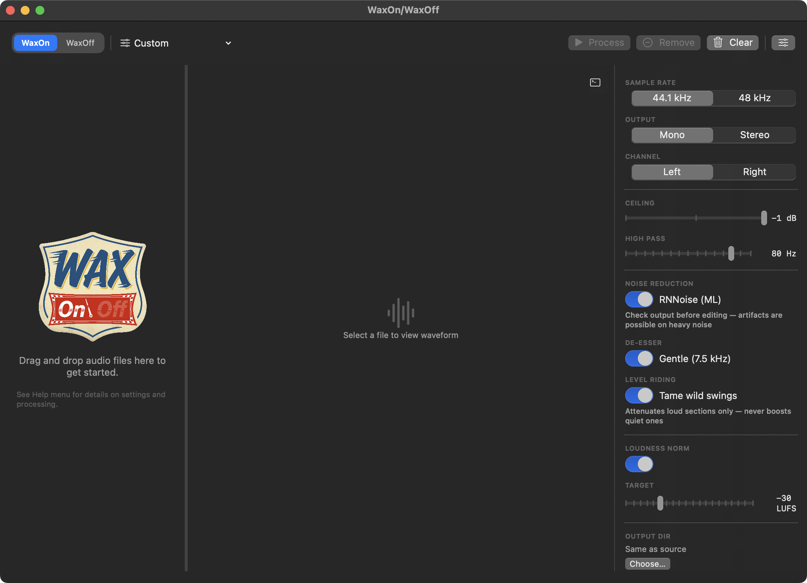
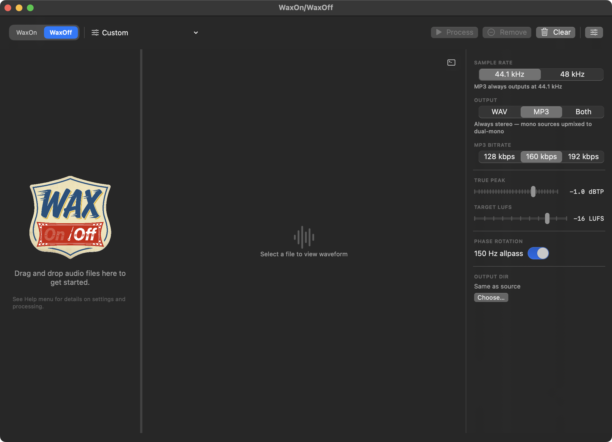

# WaxOnWaxOff

<p align="center">
  
  <br />
  <br />
  <strong>Podcast Audio Prep for macOS</strong>
  <br />
  <strong>Version: </strong>1.6.2
  <br />
  <a href="https://github.com/sevmorris/WaxOnWaxOff/releases/latest/download/WaxOnWaxOff-v1.6.2.dmg"><strong>Download</strong></a>
  ·
  <a href="https://sevmorris.github.io/WaxOnWaxOff/manual/">Manual</a>
  ·
  <a href="https://sevmorris.github.io/WaxOnWaxOff/manual/theory.html">Theory of Operation</a>
  <br />
  <br />
</p>

WaxOn/WaxOff is a two-mode audio tool for podcasters. **WaxOn** prepares raw recordings for editing: high-pass filtering, noise reduction, loudness normalization, phase rotation, and brick-wall limiting. **WaxOff** finalizes your edited mix for distribution: EBU R128 loudness normalization, true peak control, and MP3 encoding. For third-party broadcast clips going into your mix, use ClipHack.





> ⚠️ **Important: Read Before First Launch**
>
> macOS will block the app because it is not notarized with Apple. After dragging WaxOn to Applications, **run this command in Terminal:**
>
> ```
> xattr -cr /Applications/WaxOnWaxOff.app
> ```
>
> Without this step, macOS will refuse to open the app.

## WaxOn — Raw Recording Prep

Use WaxOn on raw recordings before editing. Drop your files in, configure what you care about, and get to editing.

- **High-Pass Filter** — configurable cutoff (20–90 Hz, default 80 Hz) removes rumble, HVAC hum, and handling noise; set to 20 Hz for DC Block only
- **Noise Reduction** — optional RNNoise ML-based background noise suppression (off by default); best for recordings with consistent steady-state background noise. For stereo output, channels are split and denoised independently to ensure balanced processing
- **Loudness Normalization** — optional two-pass EBU R128 with configurable target (−35 to −16 LUFS); linear gain only, dynamics fully preserved. When NR is off, the analysis pass uses noise reduction internally to prevent broadband noise from skewing the measurement, keeping the output unmodified.
- **Noise Floor Detection** — estimated noise floor displayed in the stats panel with color-coded warnings; a ⚠️ badge appears on files with high noise floors that may affect loudness accuracy
- **Brick-Wall Limiting** — 2× oversampled true peak control at the chosen ceiling (−1 to −3 dB)
- **Phase Rotation** — 200 Hz allpass to reduce peak asymmetry and improve limiter headroom
- **Mono or Stereo Output** — mono with left/right channel extraction, or stereo with per-channel noise reduction when NR is enabled
- **Sample Rate Conversion** — 44.1 kHz or 48 kHz output
- **Presets** — three built-in presets (Defaults, Edit Prep, Edit Prep EBU) plus custom presets saved and deleted from the toolbar menu
- **Batch Processing** — up to 3 concurrent jobs with per-file progress

**Output:** `{name}-{rate}waxon-{limit}.wav` (24-bit WAV)

## WaxOff — Delivery & Mastering

Use WaxOff on your finished, edited mix. Apply broadcast-standard loudness normalization and deliver as WAV, MP3, or both.

- **EBU R128 Loudness Normalization** — two-pass analysis + linear gain; no dynamic processing, stereo image and transients are unchanged
- **True Peak Control** — configurable ceiling (−3.0 to −0.1 dBTP, default −1.0)
- **WAV + MP3 Output** — 24-bit WAV, CBR MP3 (128/160/192 kbps), or both; MP3 always outputs at 44.1 kHz
- **Phase Rotation** — optional 150 Hz allpass to reduce crest factor on bass-heavy material
- **Presets** — three built-in presets (Podcast Standard, Podcast Loud, WAV Only Mastering) plus custom presets
- **Sample Rate Conversion** — 44.1 kHz or 48 kHz

**Output:** `{name}-lev-{target}LUFS.wav` / `.mp3`

### Built-In Presets

| Preset | Target | True Peak | Output | MP3 | Sample Rate |
|--------|--------|-----------|--------|-----|-------------|
| Podcast Standard | −18 LUFS | −1.0 dBTP | WAV + MP3 | 160 kbps | 44.1 kHz |
| Podcast Loud | −16 LUFS | −1.0 dBTP | WAV + MP3 | 160 kbps | 44.1 kHz |
| WAV Only (Mastering) | −18 LUFS | −1.0 dBTP | WAV only | — | 48 kHz |

## Shared Features

- **Waveform Preview** — select a file to view its waveform with dB scale
- **File Stats** — format, sample rate, channels, bit depth, duration, bit rate, RMS, peak, crest factor, integrated LUFS, and estimated noise floor
- **Noise Floor Warning** — files with a high noise floor show a ⚠️ badge in the file list and a color-coded FLOOR stat (orange above −50 dBFS, red above −40 dBFS)
- **Drag & Drop** — drop files anywhere on the window
- **Resizable Layout** — drag the divider between file list and waveform panel
- **Custom Output Directory** — optionally set a dedicated output folder
- **Reveal in Finder** — click to reveal processed files
- **Delete Key** — press Delete to remove selected files from the queue
- **Independent File Lists** — each mode keeps its own queue; switching modes doesn't disturb your work
- **Collapsible Settings Sidebar** — toggle the settings panel with the toolbar button; slides in/out from the right edge

## Workflow

```
Raw recordings → WaxOn → Edit in DAW → WaxOff → Distribute
```

## Beyond Podcasting

WaxOn was designed for podcast audio, but the prep pipeline (high-pass filtering, phase rotation, loudness normalization, and limiting) maps well to any voice-forward production workflow. If you're editing interviews, documentary dialog, or other spoken-word content outside a full DAW environment, it works the same way.

## Supported Formats

WAV, AIFF, AIF, AIFC, MP3, FLAC, M4A, OGG, Opus, CAF, WMA, AAC, MP4, MOV. FFmpeg is bundled; no separate installation required.

## System Requirements

- macOS 14.0 (Sonoma) or later
- Apple Silicon or Intel Mac

## License

Copyright © 2026. This app was designed and directed by Seven Morris, with code primarily generated through AI collaboration using [OpenClaw](https://openclaw.ai) and Claude (Anthropic).

This program is free software: you can redistribute it and/or modify it under the terms of the [GNU General Public License v3.0](LICENSE).

## A Note on AI

I'm a freelance audio engineer, not a software developer. These tools exist because AI made it possible for me to build things I couldn't build alone. These aren't products. I made them for my own use and put them out there because they might be useful to others. 

At the same time I want to acknowledge that AI raises deep questions about labor displacement, resource consumption, surveillance, the concentration of power in a small number of corporations, and the increasingly close relationship between those corporations and governments. It's reshaping culture in ways that are harder to quantify too: authors replacing illustrators with generated images, fabricated photos designed to deceive, political misinformation at scale. These aren't hypothetical risks; they're unfolding now, and the implications for ordinary people are significant.
