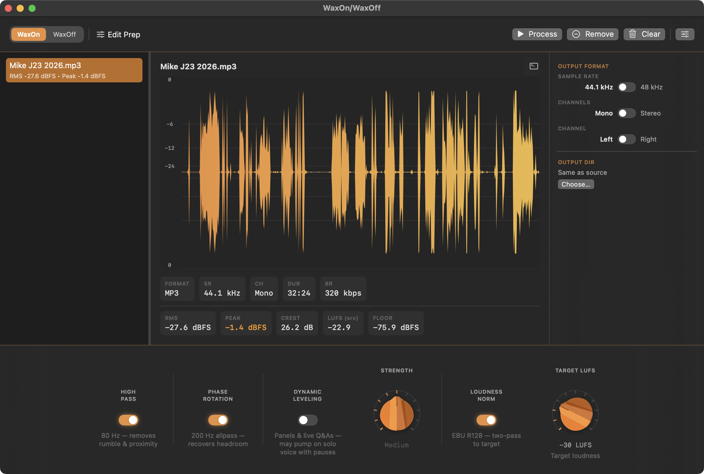
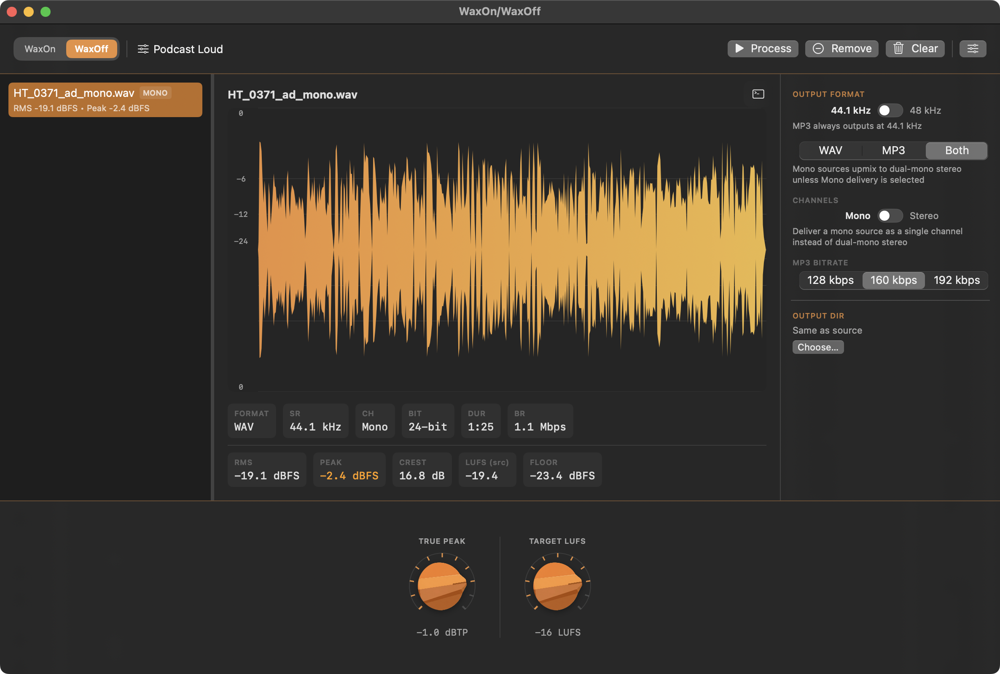

# WaxOn / WaxOff
### Two-Mode Audio Engineering Utility for macOS

<p align="center">
  <strong>Podcast Audio Prep Utility</strong>
  <br />
  <strong>Version:</strong> 2.12.0
  <br />
  <a href="https://github.com/sevmorris/WaxOnWaxOff/releases/latest/download/WaxOnWaxOff-v2.12.0.dmg"><strong>Download Latest (DMG)</strong></a>
  <br />
  or <code>brew install --cask sevmorris/tap/waxonwaxoff</code>
  <br />
  <br />
  <a href="https://sevmorris.github.io/WaxOnWaxOff/">App Page</a>
  ·
  <a href="https://sevmorris.github.io/WaxOnWaxOff/manual/">Manual</a>
  ·
  <a href="https://sevmorris.github.io/WaxOnWaxOff/manual/theory.html">Theory of Operation</a>
  ·
  <a href="CHANGELOG.md">Changelog</a>
</p>

**WaxOn/WaxOff** solves a specific problem: you receive a guest recording that's quiet, uneven, or poorly leveled, and you need a consistent prep WAV before you open your session—or a finished mix normalized to your delivery spec. No import-normalize-export dance. No sending audio to a cloud service.

WaxOn **conditions** level and dynamics (high-pass, optional dynamic leveling, optional EBU R128 gain, true-peak control). For plosives, clicks, and heavy noise, use a repair tool (e.g. iZotope RX) before WaxOn.

<p align="center">
  
  
</p>

The app runs in two stages that map onto the two moments in podcast production where repetitive manual work otherwise lives:

- **WaxOn** runs before you edit. It conditions the raw file — high-pass filter, optional EBU R128 normalization (dynamics fully preserved), and peak control to a fixed −1.0 ceiling — a brick-wall limiter holding samples at −1.0 dBFS when Loudness Norm is on, downward-only true-peak normalization to −1.0 dBTP when off. Output is a prep-ready 24-bit WAV named to stay sortable alongside the source in Finder (e.g., `interview-44kwaxon.wav`).
- **WaxOff** runs after you bounce. It takes your finished mix to broadcast-compliant delivery — EBU R128 to target LUFS, true peak ceiling, WAV and/or MP3 output.

**Local processing:** No upload, no subscription, no audio leaving your machine. Transparent, inspectable signal chain.

**vs. iZotope RX:** Not a replacement for surgical repair — plosives, deep clicks, and spectral cleanup are still RX's job. But for the repetitive normalize → EQ → bounce work on clean-enough files, RX is overkill. WaxOn handles that stage in a single drop.

**vs. a bash script:** The two-stage model and the preset system. WaxOn presets encode your processing decisions so batches are repeatable. WaxOff presets capture your delivery spec per platform.

---

## I. WaxOn — Signal Conditioning (Prep)
*Use on raw recordings prior to non-destructive editing.*

* **High-Pass Filter:** On (80 Hz) or Off (20 Hz DC floor). DC offset always removed.
* **Dynamic Leveling:** Optional `dynaudnorm` with adjustable strength (Gentle → Aggressive) for panel/multi-voice sources with inconsistent levels.
* **Loudness Normalization:** Optional EBU R128 linear gain — integrated loudness measured once with `ebur128`, then one constant gain (dynamics fully preserved; default off). See [Theory of Operation](https://sevmorris.github.io/WaxOnWaxOff/manual/theory.html).
* **Floor Monitoring:** Estimated noise floor detection with color-coded warning badges.
* **Peak Control:** Fixed −1.0 ceiling, applied two ways. With Loudness Norm on, a brick-wall limiter holds sample peaks at −1.0 dBFS. With it off, a single downward gain brings true peak to −1.0 dBTP and nothing is limited (transparent when the source is already under ceiling).
* **Phase Rotation:** Optional 200 Hz allpass filter to reduce peak asymmetry and maximize headroom (default on).

**Output Logic:** `{name}-{44k|48k}waxon.wav` (24-bit)

## II. WaxOff — Broadcast Delivery
*Use on finished mixes to ensure broadcast compliance.*

* **EBU R128 Normalization:** Two-pass analysis + linear gain; no dynamic compression.
* **True Peak Management:** Configurable ceiling (−3.0 to −0.5 dBTP).
* **Multi-Format Delivery:** 24-bit WAV, CBR MP3 (up to 192 kbps), or simultaneous output.
* **Mono Delivery:** Optional true single-channel output for mono sources (defaults to dual-mono stereo); never downmixes a stereo source.
* **Episode Metadata:** Per-file podcast name, episode title, cover art and chapter marks, written into the delivered MP3 as ID3v2.3 `TALB`, `TIT2`, `APIC` and `CHAP`/`CTOC`. Chapters take a pasted `MM:SS Title` list or an editable table. Leave it untouched and the file delivers exactly as before.

**Output Logic:** `{name}-lev{target}LUFS.[wav/mp3]` (target is e.g. `-18LUFS`)

---

## Install

**Homebrew**

```sh
brew install --cask sevmorris/tap/waxonwaxoff
```

Upgrade the same way you installed — `brew upgrade --cask waxonwaxoff`. The app also checks GitHub for new versions and offers a **Download** button, but that opens the DMG rather than installing it, so following it leaves Homebrew's records stale.

**DMG**

Download from the link above, open it, and drag **WaxOn/WaxOff** to your Applications folder.

Either way you get the same notarized build. Requires macOS 14.0+ on Apple Silicon; the cask declares both, so Homebrew refuses rather than installing an app that cannot launch.

---

## Operational Specifications
* **Waveform Audit:** Real-time waveform preview with dB scaling.
* **Metadata Stats:** RMS, Peak, ISP (est.), Crest Factor, Integrated LUFS, and Floor estimation.
* **Concurrency:** Adaptive batch processing — scales with available CPU cores.
* **Environment:** macOS 14.0+ (Sonoma) on **Apple Silicon (M-series) Macs** (arm64). Intel Macs are not supported.
* **Dependencies:** Bundled FFmpeg; no external installation required.

### Security model
The app ships with **App Sandbox disabled** so it can launch the bundled `ffmpeg` and `ffprobe` binaries via `Process()` (sandboxed apps cannot exec non-sandboxed helpers). That means the app can read and write anywhere your user account can once you grant a path through drag-and-drop or the file picker—same trust model as a typical command-line tool. Download builds from the [official releases](https://github.com/sevmorris/WaxOnWaxOff/releases) only; `release.sh` codesigns and notarizes the DMG. See `WaxOnWaxOff/WaxOnWaxOff.entitlements` for the documented rationale.

## Building from Source

Requires **Xcode 26 or later (Swift 6.2+)**. The app opts several classes out of MainActor-isolated `deinit`, which is [SE-0371](https://github.com/swiftlang/swift-evolution/blob/main/proposals/0371-isolated-synchronous-deinit.md), implemented in Swift 6.2; Xcode 16.4 and earlier gate it behind an experimental flag and fail to compile. CI builds on Xcode 26.3.

```bash
git clone https://github.com/sevmorris/WaxOnWaxOff.git
cd WaxOnWaxOff
open WaxOnWaxOff.xcodeproj
```

Xcode runs `scripts/fetch-ffmpeg.sh` automatically before each build, so the very first build will pull pinned `ffmpeg` and `ffprobe` (~44 MB combined) from a [GitHub release asset](https://github.com/sevmorris/WaxOnWaxOff/releases/tag/ffmpeg-deps-8.0-audio-arm64-r2) and verify SHA-256s. You can also run the script standalone for CI or to re-verify checksums. Those binaries are built by `scripts/build-ffmpeg.sh` in this repository — audio-only, LGPL, no GPL components. See `Vendor/README.md` for the manifest, licenses, and update instructions.

## Technical Origin
I designed the signal chain and DSP parameters. The Swift implementation was built with AI assistance. The audio processing logic — two-pass loudnorm per the FFmpeg spec and ITU-R BS.1770-compliant K-weighting — reflects deliberate choices, not defaults.

---

### Support
If WaxOn/WaxOff saves you time, [buy me a coffee](https://ko-fi.com/sevmo). Free forever either way.

### License
Copyright © 2026 Seven Morris.
Distributed under the [GNU General Public License v3.0](LICENSE).

Bundled FFmpeg binaries: see [`Vendor/README.md`](Vendor/README.md) for versions, checksums, licenses, and LGPL source directions.
